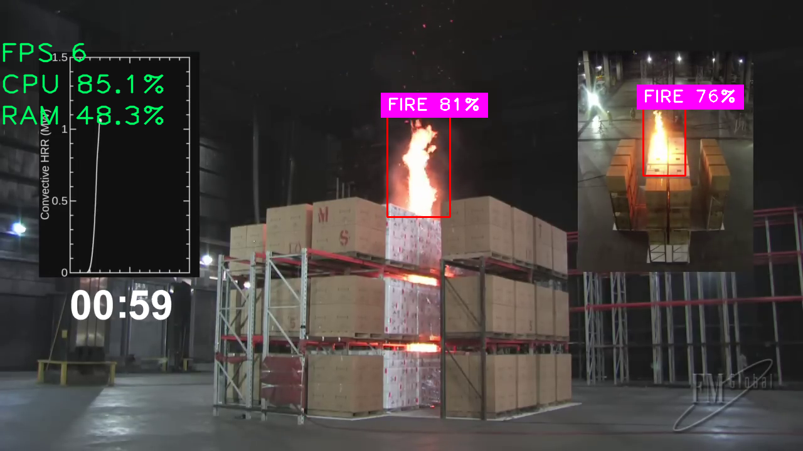

# upgrade-pancir-2024

AI solution for "Fire and smoke detection in production and storage facilities" case from Pancir company at hackathon "Upgrade: My first hackathon".

## problem

today's smoke detectors are not the best, so we need an additional verification layer to prevent fires in various industrial facilities.

## used technologies

- python
- yolo v8
- opencv2
- kaggle vm

## screenshot



## installation

```bash
git clone https://github.com/mishkafreddy2009/fsdet.git
cd fsdet
python -m venv .venv
source ./.venv/bin/activate
pip install -r requirements.txt
```
## usage

```bash
# for default configuration
python main.py

# if you have custom model
python main.py --model <model path>

# if you have custom video file
python main.py -v <video file path>

# if you have both
python main.py --model <model path> -v <video file path>
```
